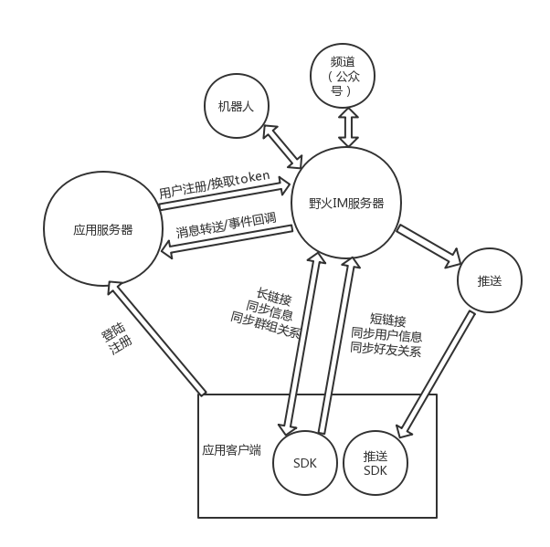
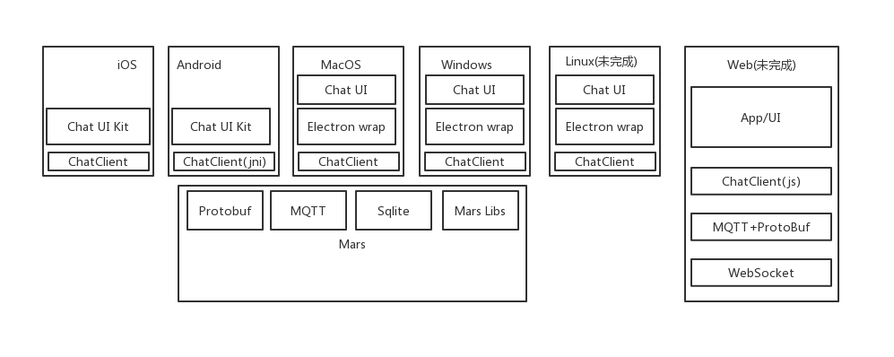
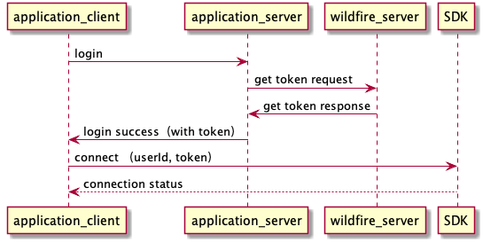
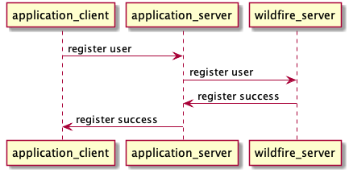

# 系统架构
野火IM除了提供基础IM功能外，还提供群组托管/用户信息托管/好友关系托管等功能，其中用户信息托管和好友关系托管为可选功能，客户可以自己处理用户信息和好友关系，仅仅使用im和群组托管能力。也可以把用户信息和好友关系导入到野火IM中去，SDK和UI更容易使用。

## SDK
SDK内嵌于应用内，只需要调用connect，传入用户Id和token，SDK会自动做好连接/重连、消息同步、群组关系同步、用户信息同步、好友关系同步等。移动客户端和PC客户端使用微信Mars和自定义协议实现，使用C++实现具有跨平台功能。Web客户端使用自定义协议和websocket实现。IMLib是SDK的接口层，负责mars和协议在不同平台的wrapper。
 
> 目前仅实现了移动端平台，mac/windows/web平台暂未实现。其中mac/windows平台的实现较为容易，会很快提供SDK。

## 应用服务器
应用服务器需要处理用户注册/用户登陆等业务。如果使用用户信息托管切包含用户密码，则可以去野火IM服务器登陆换取token。如果没有使用用户信息托管或没有托管密码，则登陆时，应用服务器需要去野火IM服务器换取token。

## 野火IM服务器
负责IM业务的处理，负责群组业务的处理，负责用户信息于好友关系的处理。

## 应用客户端
应用客户端，使用sdk，负责im的UI展示。野火IM提供一个简单的demo，可以作为一个聊天客户端直接使用，也可以移植聊天相关的UI到客户应用中去。

## 推送
野火IM会把需要推送的信息发送到推送服务器，推送服务器推送信息到APNS/华为推送/小米推送等。其中android平台有推送SDK。推送服务和推送SDK都是开源的。

## 机器人服务
可以在野火IM服务中添加机器人角色，然后所有发给机器人的消息都会发送到指定的服务，处理后可以用过IM服务发回去。在我们的demo中有个“小火”的机器人，可以单聊或在群里@。

## 频道服务（未完成)
频道是有点类似与微信中的公众号功能，用户可以订阅，然后频道主可以发送消息给所有订阅用户。可以部署频道服务来处理类似微信公众号的功能。

## 流程图
#### 登陆
  * 登陆
  

#### 注册用户
  * 托管用户信息

  

  * 不托管用户信息
  注册时不用同步用户信息到野火IM服务器，获取token不依赖必须存在用户信息。
